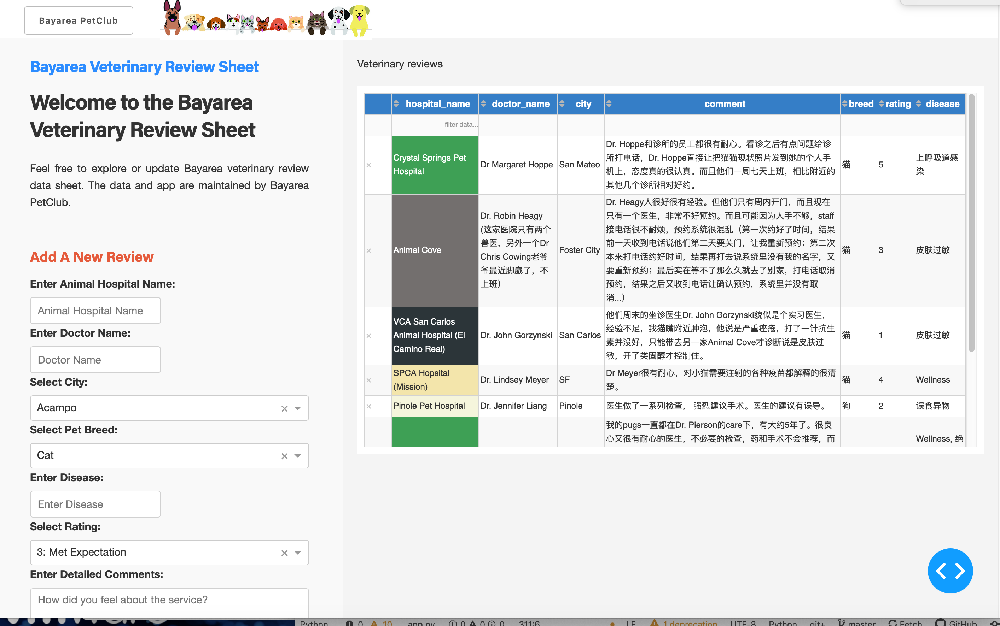

# Bayarea Veterinary Review Table

## About this app

This dashboard allows you to explore and update Bayarea Veterinary Reviews.  The dashboard and data is maintained by [Bayarea PetClub](ruxiz2020.github.io/petclub/).

## Requirements

* Python 3

## How to run this app

We suggest you to create a virtual environment for running this app with Python 3. Clone this repository
and open your terminal/command prompt in the root folder.

```
git clone https://github.com/ruxiz2020/bayarea_vet_table.git
cd bayarea_vet_table
python3 -m virtualenv venv

```
In Unix system:
```
source venv/bin/activate

```
In Windows:

```
venv\Scripts\activate
```

Install all required packages by running:
```
pip install -r requirements.txt
```

Run this app locally with:
```
python app.py
```

## Screenshot



## Resources

* [Dash](https://dash.plot.ly/)
* Inspired by [Dash Plotly template](https://dash-gallery.plotly.host/dash-clinical-analytics/).
